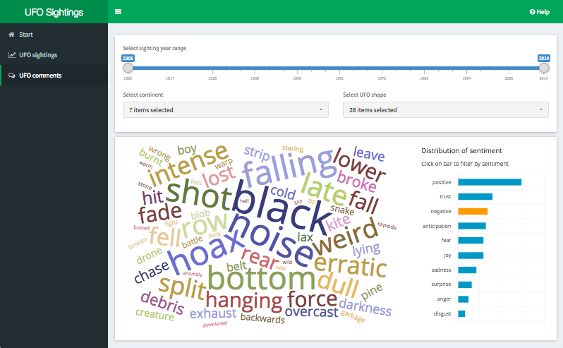
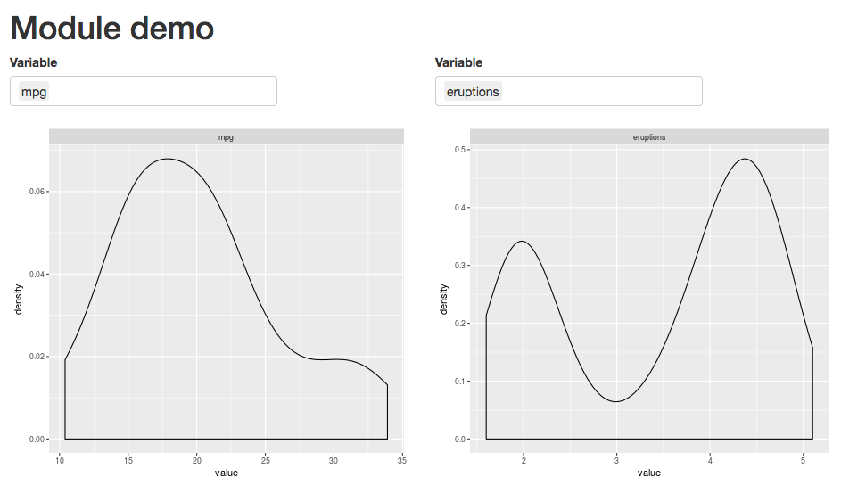
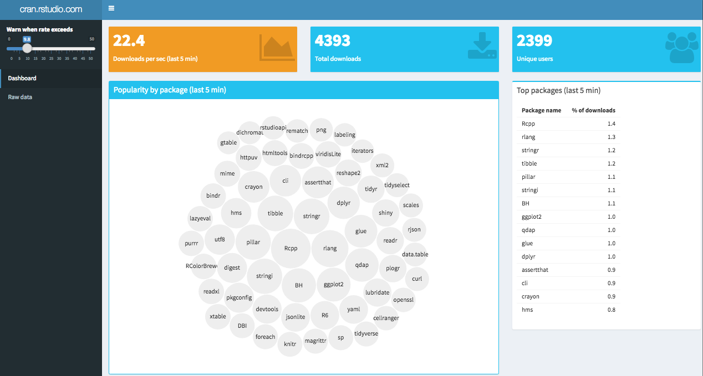

## About me

<div class="columns-2">
- Lead Data Scientist at Quantiful
- Tool builder
- Co-organiser Auckland R Meetup Group
- Educator


</div>


## Overview

>- Example application
>- Why use R for web apps?
>- Visualisations and widgets
>- Reusability
>- Collaboration
>- Data backend
>- Production


## Example Shiny app -- UFOs anyone?



<div style="width:70%; margin-top: -40px; text-align: right">
  <a href="https://nz-stefan.shinyapps.io/ufo-sightings/" style="font-size: 10pt">
    https://nz-stefan.shinyapps.io/ufo-sightings/
  </a>
</div>


# Why use R for web apps???


## Two extremes to develop an app {.build}

<div class="columns-2">
### Off-the-shelf dashboards 
>- PowerBI, Tableau, QuickSight, ...
>- <div class="green">Easy to create, publish and share</div>
>- <div class="green">Rapid development</div>
>- <div class="red2">Limited customisation</div>
>- <div class="red2">No version control</div>
>- <div class="red2">Definition of charts buried in UI</div>
>- <div class="red2">No automatic testing</div>

### Custom web app
>- Angular, ReactJS, Ember, ...
>- <div class="green">Engineering control</div>
>- <div class="green">Flexibility</div>
>- <div class="red2">Learning curve</div>
>- <div class="red2">Costly development</div>
>- <div class="red2">Development spread across multiple teams</div>
</div>


## Meet Shiny

>- "Build interactive web apps straight from R"
>- <div class="green">Code based -- version control, easy to collaborate, changelogs, clear chart definitions, easy search for help</div>
>- <div class="green">No deep HTML/CSS/JS knowledge required</div>
>- <div class="green">Reasonable flexibility</div>
>- <div class="green">Rapid development</div>


>- <div class="red2">Scalability</div>
>- <div class="red2">Performance</div>
>- <div class="red2">Requires deployment and security</div>


## Visualisations and widgets {.build}

### Charts
- [highcharter](http://jkunst.com/highcharter/highcharts.html) -- fancy charts with animations and all
- [plotly](https://plot.ly/r/) -- fast rendering scientific charting engine
- [d3wordcloud](https://github.com/jbkunst/d3wordcloud) -- fancy word clouds

### Maps and tables
- [leaflet](https://rstudio.github.io/leaflet/) -- clickable interactive maps
- [DT](https://rstudio.github.io/DT/) -- clickable tables with filtering, pagination, sorting


## Visualisations and widgets (2) {.build}

### Widgets
- [shinyWidgets](https://github.com/dreamRs/shinyWidgets) -- custom widgets to pimp your shiny apps
- [shinycssloaders](https://github.com/andrewsali/shinycssloaders) -- CSS loader animations for Shiny outputs
- [rintrojs](https://github.com/carlganz/rintrojs) -- step-by-step help messages

### Themes
- [shinydashboard](https://rstudio.github.io/shinydashboard/) -- well supported Bootstrap theme
- [shinymaterial](https://ericrayanderson.github.io/shinymaterial/) -- "material design" theme


## Reusability {.build}

### Shiny modules
- Break complex logic into separate modules
- Reusable, independent components
- Package and distribute modules for other authors


## Module example in 35 lines of code



<div style="width:80%; margin-top: -40px; text-align: right">
  <a href="https://nz-stefan.shinyapps.io/shiny-module-example/" style="font-size: 10pt">
    https://nz-stefan.shinyapps.io/shiny-module-example/
  </a>
</div>


## Collaboration

>- Shiny app = R code
>- Effecient collaboration via version controlled code repository (e.g. GIT)
>- Packrat -- Package management for R


## Data backends

>- R can access almost any data source
>- Local files -- text (`readr`), JSON (`jsonlite`), Excel (`readxl`), spatial (`sf`)
>- RDBS -- convenient DB connection management (`pool`) and access (`dbplyr`)
>- NoSQL -- MongoDB (`mongolite`), ElasticSearch (`elastic`), Redis (`redux`), Spark (`sparklyr`)
>- Data services -- Google Sheets (`googlesheets`), Dropbox (`rdrop2`), AWS S3 (`aws.s3`)
>- REST APIs -- generic (`httr`), Twitter (`rtweet`), Google Analytics (`googleAnalyticsR`), ...

  
## Example -- Data streaming in Shiny



<div style="width:70%; margin-top: -40px; text-align: right">
  <a href="https://gallery.shinyapps.io/087-crandash/" style="font-size: 10pt">
    https://gallery.shinyapps.io/087-crandash/
  </a>
</div>


## Data backends -- ElasticSearch

>- Distributed, RESTful search and analytics engine
>- Stores schema-free JSON documents
>- Near real-time search and retrieval
>- Reasonably featured JSON based query language (boolean filters and aggregations, limited join capability)
>- Package [`elastic`](https://github.com/ropensci/elastic) provides interface from R
>- Package [`jqr`](https://cran.r-project.org/web/packages/jqr/vignettes/jqr_vignette.html) provides convenient and fast conversion of nested JSON response into dataframe


# Production

## Deployment -- shinyapps.io

### "Deploy your Shiny applications on the Web in minutes"
>- <div class="green">Push-button solution from RStudio</div>
>- <div class="green">Free and paid tiers available</div>
>- <div class="green">Paid tier offers enterprise features</div>
>- <div class="green">Convenient interface to tune deployment and see usage stats</div>
>- <div class="red">Loading times of deployed app</div>
>- <div class="red">Advanced features can be pricy</div>
>- <div class="red">No control over location of deployment</div>


## Deployment -- ShinyProxy

### "Deploy Shiny apps in an enterprise context"
>- Enterprise features: authentication, scalability (wihtin reason), control over memory and CPU
>- Docker based -- Shiny app installed into docker container that spins up on user request
>- Java Spring responsible for user authentication and container spin-up


## Security -- ShinyProxy + SSL

```{r echo=FALSE}
DiagrammeR::grViz("
digraph rmarkdown {
rankdir = LR
node [shape = box,
        fontname = Helvetica]
User; 'Web\nserver'; ShinyProxy; 'Shiny\ncontainer';

User -> 'Web\nserver' [label = 'https\nrequest']
'Web\nserver' -> ShinyProxy [label = 'forward\nrequest']
ShinyProxy -> 'Shiny\ncontainer' [label = 'spin up']
}
", height = 200)

```

- Web server, e.g. nginx, responsible for SSL encryption
- ShinyProxy responsible for user authentication
- Shiny container responsible for serving Shiny app


# Want to learn more?

##  {.flexbox .vcenter}

<div class="centered">
<h2>Data Science Academy</h2>

**www.datascienceacademy.co.nz**
</div>
